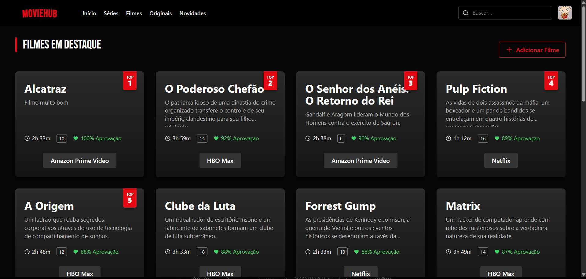
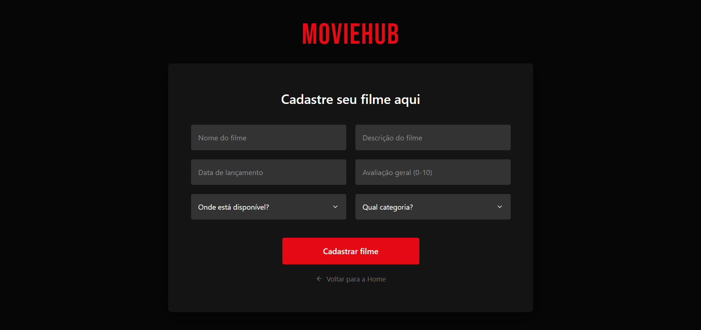
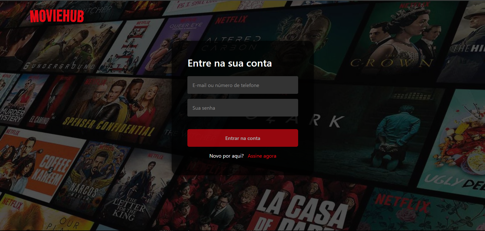
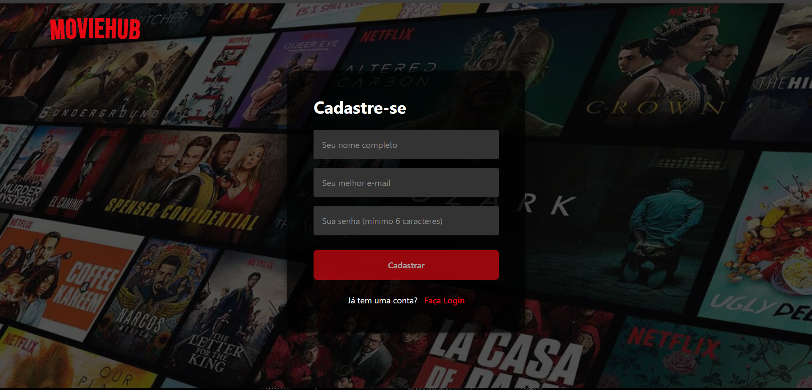

# 🎬 MovieHub


> **MovieHub** é uma aplicação Fullstack robusta para catálogo e gestão de filmes, integrando um backend seguro em Spring Boot com um frontend moderno e reativo em Angular.

---

## 📸 Funcionalidades & Interface (UX)

### 🍿 Catálogo e Gestão
A aplicação conta com um dashboard imersivo e formulários reativos para gestão de conteúdo.

| Catálogo Dinâmico (Home) | Cadastro de Filmes |
|:-------------------------:|:-------------------:|
|  |  |
| *Cards com carrossel automático de streamings e indicadores de qualidade.* | *Formulário reativo com validação de dados e conversão automática de datas.* |

### 🔐 Autenticação e Feedback Visual
Experiência de usuário aprimorada com **SweetAlert2** para feedbacks de sucesso e erro, substituindo os alertas nativos do navegador.

| Login Seguro | Feedback de Sucesso (Login) |
|:-------------------------:|:-------------------:|
|  |  |
| *Interface limpa com tratamento de erros (401/403).* | *Feedback visual imediato e redirecionamento automático.* |

| Cadastro de Usuário | Feedback de Criação |
|:-------------------------:|:-------------------:|
|  |  |
| *Validação de e-mail e senha forte.* | *Confirmação visual estilizada.* |

---

## 🛠️ Tecnologias Utilizadas

### Backend (API RESTful)
* **Java 17 & Spring Boot 3:** Base sólida e performática.
* **Spring Security & JWT:** Autenticação Stateless segura com tokens Bearer.
* **Hibernate/JPA:** Mapeamento Objeto-Relacional eficiente.
* **Swagger/OpenAPI:** Documentação automática da API.
* **PostgreSQL:** Banco de dados relacional robusto.

### Frontend (SPA)
* **Angular 17+ (Standalone Components):** Arquitetura moderna sem NgModules.
* **Reactive Forms:** Controle total sobre validação de dados e estado dos formulários.
* **RxJS:** Manipulação de fluxos assíncronos e integração com API.
* **Guards:** Proteção de rotas baseada na validade e expiração do token.
* **SweetAlert2:** Experiência de usuário (UX) aprimorada para feedbacks.

---

## 🏗️ Arquitetura e Modelagem

O projeto segue uma arquitetura em camadas bem definida para garantir escalabilidade e manutenção.

### Modelagem de Dados
O sistema gerencia o relacionamento complexo entre Filmes, Categorias e Serviços de Streaming.


### Destaques de Implementação
* **Segurança:** Implementação customizada de `UserDetailsService` e Filtros de Segurança para interceptar e validar requisições HTTP.
* **Tratamento de Erros:** `ControllerAdvice` global para padronizar respostas de erro (401, 403, 400) para o cliente.
* **Frontend Interativo:** Lógica de "Carrossel de Streaming" no frontend para lidar com múltiplos provedores por filme de forma visualmente agradável.

---

## 🚀 Como Executar

### Pré-requisitos
* Java 17+
* Node.js & NPM
* PostgreSQL
* Maven

### 1. Backend (Spring Boot)
1.  Configure o banco de dados PostgreSQL no arquivo `application.properties`.
2.  Execute o projeto:
    ```bash
    ./mvnw spring-boot:run
    ```
3.  Acesse o Swagger UI: `http://localhost:8080/swagger-ui.html`

### 2. Frontend (Angular)
1.  Navegue até a pasta do frontend.
2.  Instale as dependências:
    ```bash
    npm install
    ```
3.  Inicie o servidor de desenvolvimento:
    ```bash
    npm start
    ```
4.  Acesse: `http://localhost:4200`

---

## 🤝 Autor

Desenvolvido por **Matheus Plaza** com foco em Clean Code e Melhores Práticas de Desenvolvimento Web.

[](https://www.linkedin.com/in/matheus-plaza)
[](https://github.com/matheus-plaza)
